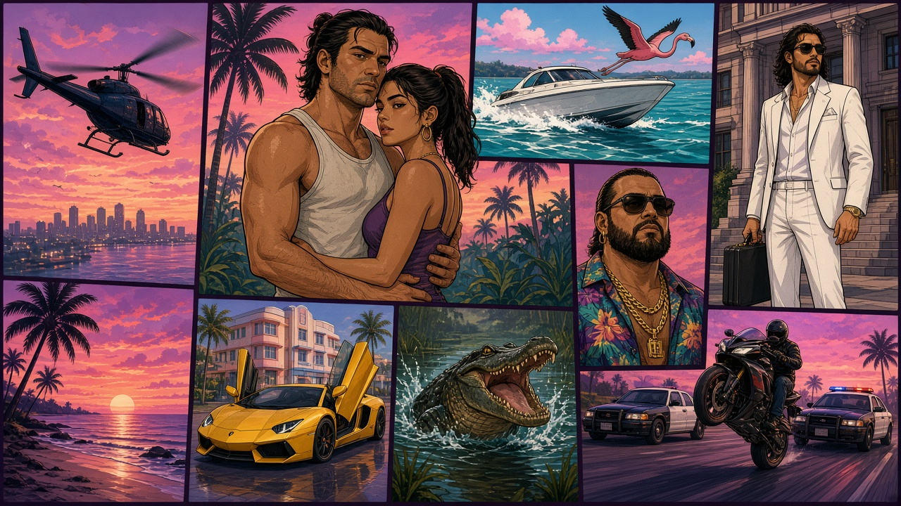
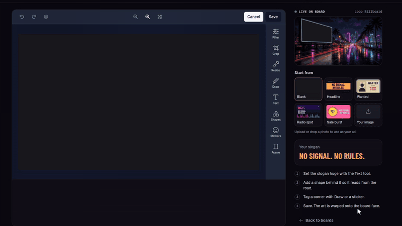
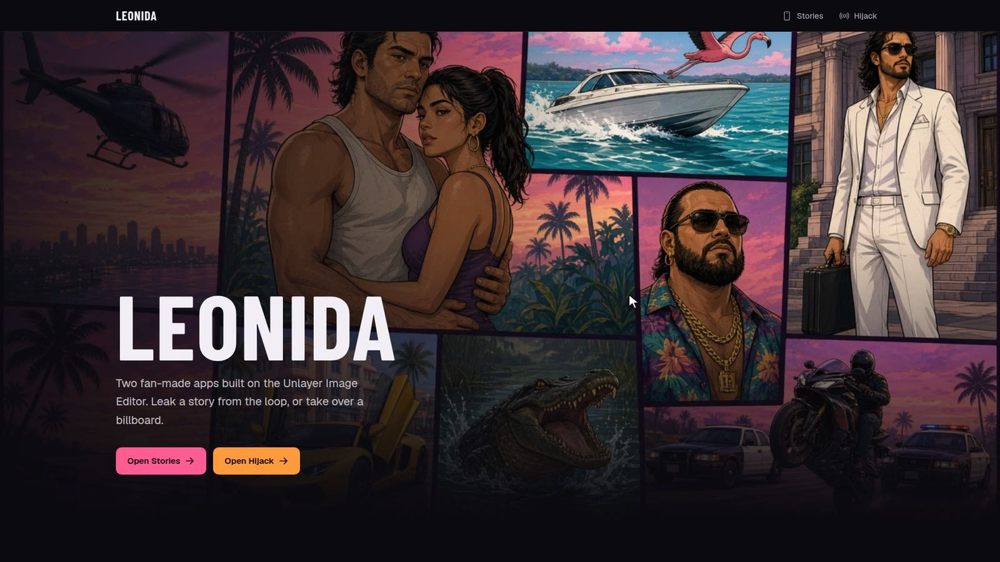
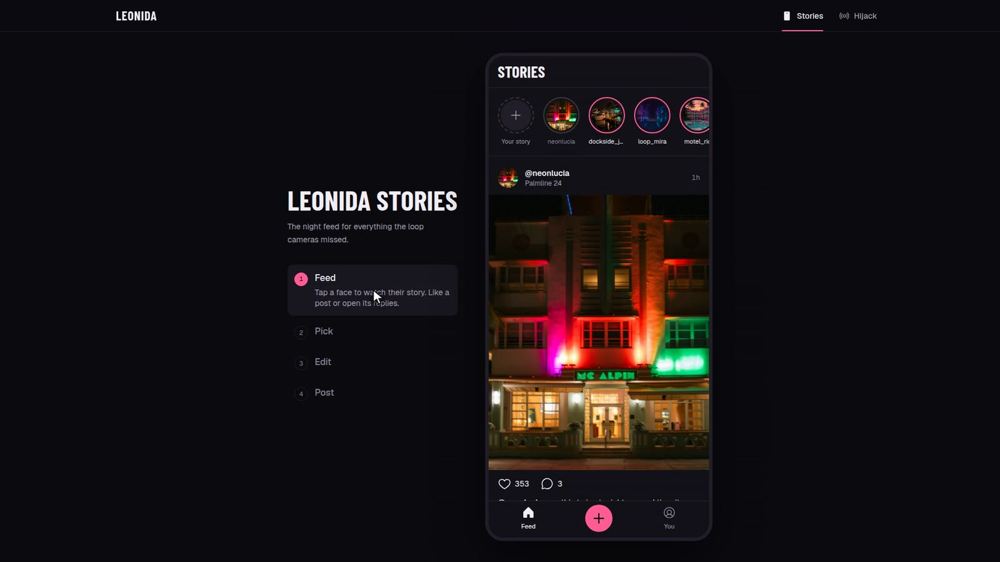
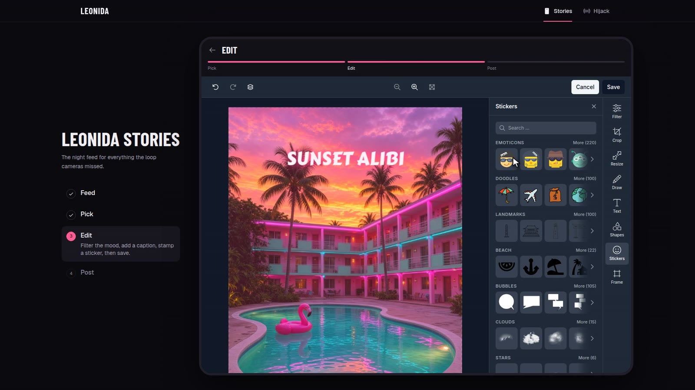
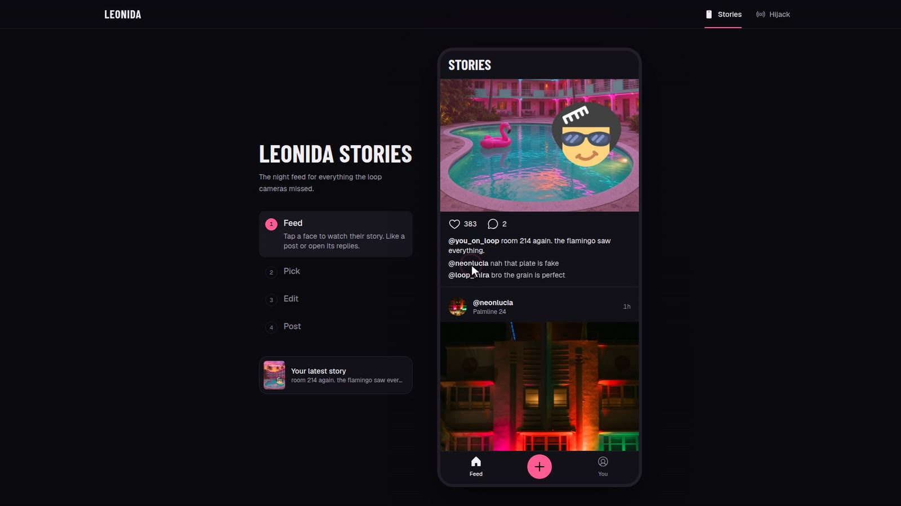
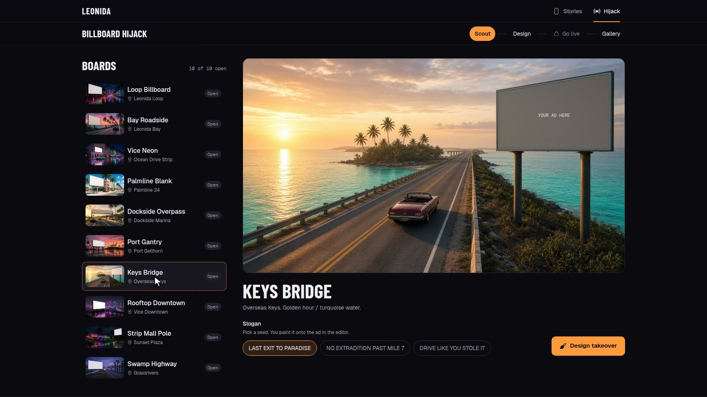
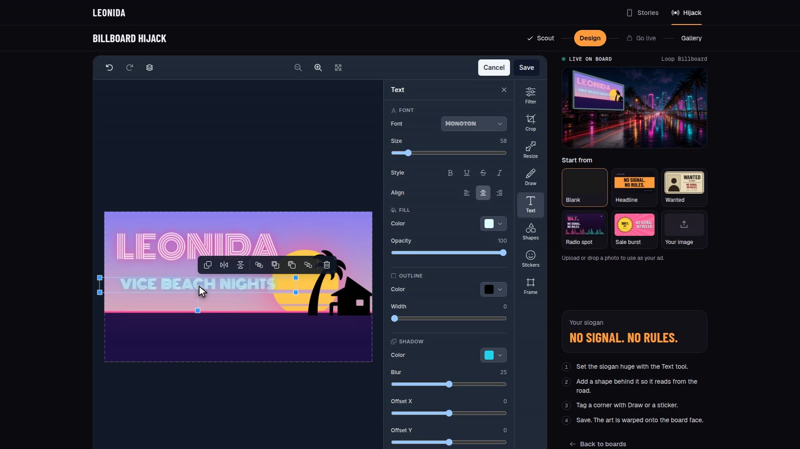
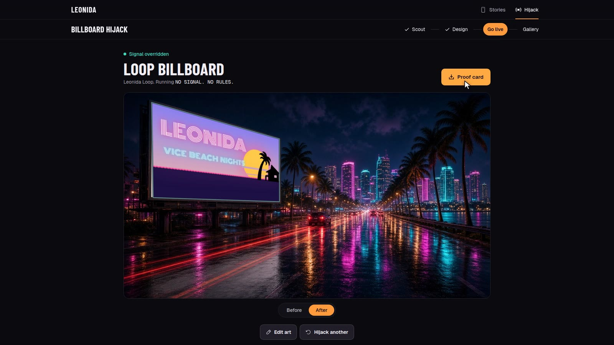
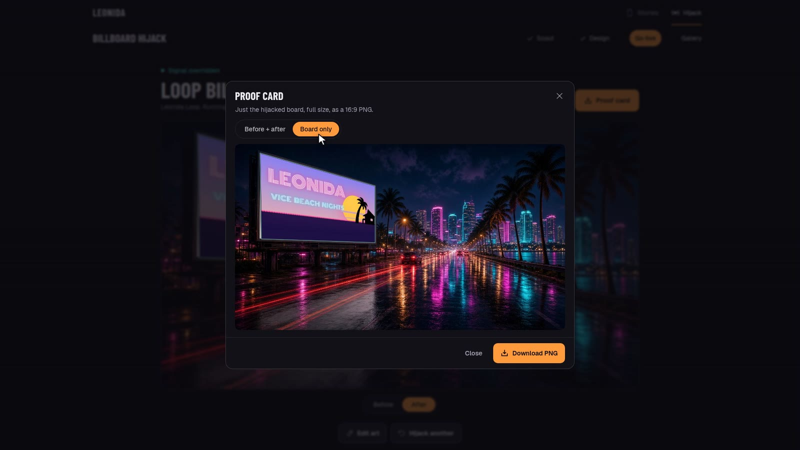

# Leonida



**Spill the city's secrets. Take over its skyline.**

Leonida is two small creative apps in a sun-soaked, neon-lit state inspired by GTA VI. Both run on the [Unlayer React Image Editor](https://github.com/unlayer/react-image-editor), and both put the editor at the center:

- **Leonida Stories** starts from a night scene. Edit it with filters, neon captions and stickers, then drop it into a fictional city feed of NPC posts and replies. The feed is flavor. The point is the edit.
- **Billboard Hijack** hands you ten blank boards across Leonida. Design a rogue ad from scratch or from a template, watch it appear on the board live as you edit, then go live with perspective-correct projection and download proof.

You can't finish either loop without saving from the editor. Every feed card, share card and billboard is built from what you made.

### ▶ [Try it live: leonida-one.vercel.app](https://leonida-one.vercel.app/) · 🧭 [Judge's walkthrough](WALKTHROUGH.md)

Built for Unlayer's **Build with React Image Editor Challenge** · `@unlayer/react-image-editor@1.0.2` · `#BuiltWithImageEditor`

[Requirements](#challenge-requirements) · [Demo](#demo) · [Screenshots](#screenshots) · [Apps](#apps) · [Run locally](#run-locally) · [Credits](#asset-credits)

<sub>Original art and fictional places. Not affiliated with, sponsored by, or endorsed by Rockstar Games or Take-Two Interactive.</sub>

## Challenge requirements

Every requirement from the [challenge FAQ](https://unlayer.notion.site/Build-With-Image-Editor-Challenge-FAQ-3cf0ceb4c8e180309d91cd730811ebd1):

- [x] **Original GTA VI-inspired experience:** a Stories editor with a fictional city feed, and a billboard-hijack loop set in Leonida ([The idea](#the-idea)).
- [x] **React Image Editor is a core part:** both main loops require saving from the editor; the saved image drives the feed, share card, billboard and proof card ([Why Image Editor is core](#why-image-editor-is-core)).
- [x] **Users edit or customize a visual:** a story photo in Stories and a 16:9 billboard ad in Hijack, with all eight tools enabled.
- [x] **Supports the React Image Editor repository:** starred [unlayer/react-image-editor](https://github.com/unlayer/react-image-editor).
- [x] **Complete source in a public GitHub repo:** [AshThunder/leonida-built-with-image-editor](https://github.com/AshThunder/leonida-built-with-image-editor); the editor integration is in [`packages/leonida-ui/src/LeonidaEditor.tsx`](packages/leonida-ui/src/LeonidaEditor.tsx).
- [x] **Clear README:** what we built, the idea, how the editor is used, screenshots and a GIF, and how to run it.
- [x] **Deployed and publicly accessible:** [leonida-one.vercel.app](https://leonida-one.vercel.app/).
- [x] **Submitted through the official form** before September 24, 2026, 23:59 UTC.
- [x] **Original assets only:** no Rockstar/GTA logos, characters, screenshots or leaked material; plates and scenes are original ([credits](#asset-credits)).

## The idea

GTA VI's Leonida is a state that lives on its phone. Everyone films everything, and every overpass has a billboard selling something. We wanted two creative loops in that world:

- **A night scene you actually edit.** Not a menu of canned photos: you grab a scene, make it yours in a real editor, then see it sit among fictional NPC posts as flavor around what you made.
- **A way to leave your mark on the skyline.** Billboards are the loudest thing in Leonida, so the second loop is hijacking one. You design the ad and see it on the board, lit by the street, like it's always been there.

Both are small, focused loops where the creative part is the point, which is exactly what an embedded image editor is good at.

## Demo

[~2 min walkthrough of Stories and Hijack](https://youtu.be/EFrNQlJQSzE)

## Screenshots

**Building a Hijack ad from a blank canvas** (timelapse, 16×): gradient sky, glowing sun, sea, neon horizon, palm sticker and neon text, with the live board preview on the right.



| | |
|---|---|
|  **Landing:** both apps, one editor underneath |  **Stories feed:** NPC stories as flavor around your edit |
|  **Stories editor:** filter, neon caption, stickers |  **Saved:** your edit lands in the fictional feed |
|  **Scout:** ten blank boards across Leonida |  **Design:** the finished ad, with the board updating live |
|  **Live:** the ad projected onto the Loop billboard |  **Proof card:** download before + after, or the board alone |

A step-by-step tour with more screenshots is in [WALKTHROUGH.md](WALKTHROUGH.md).

## Apps

| App | Path | Served at | Fantasy |
|---|---|---|---|
| **Landing** | `apps/site` | `/` | Hero, the two apps side by side, and the editor tools they share |
| **Leonida Stories** | `apps/leonida-stories` | `/stories/` | Edit a night scene, then place it in a fictional city feed of NPC posts |
| **Billboard Hijack** | `apps/billboard-hijack` | `/hijack/` | Scout one of 10 blank billboards, design a rogue ad, and see it warped onto the board with before/after proof |

All three share one design system and editor wrapper in `packages/leonida-ui` (phone/map look, Leonida neon, Barlow Condensed + Geist).

## Why Image Editor is core

- **Stories:** Pick a scene (or upload a photo) → edit (filter / text / stickers / …) → **Save required to continue** → the feed card, replies and share card all use the saved `dataUrl`.
- **Billboard:** Pick a board → design the 16:9 ad in the editor → Save → the art is projected onto the board face with a true perspective homography → before/after view and proof card.

All eight tools are enabled (dark theme): filter, crop, resize, draw, text, shapes, stickers, frame. Both apps mount the same `LeonidaEditor` wrapper.

More Unlayer features in use:

- **Live board preview (Hijack):** while you design, the board plate beside the editor redraws from `editor.getImage()` about once a second.
- **Starter templates (Hijack):** Blank, Headline, Wanted, Radio spot and Sale burst are rendered on a canvas with your slogan and loaded into the editor.
- **Your own image (Hijack and Stories):** upload or drop a photo; in Hijack it is cover-cropped to the 16:9 ad canvas before it loads.

## Hijack flow

1. **Scout:** 10 original Leonida plates (Loop freeway, Bay Roadside, Vice Neon, Palmline, Dockside, Port Gantry, Keys Bridge, Rooftop Downtown, Strip Mall Pole, Swamp Highway), each with its own lighting.
2. **Design:** template or blank canvas, live board preview beside the editor.
3. **Go live:** the board flashes from Before to After; a Before / After toggle sits under it.
4. **Proof card:** download either the **Before + after** card or the **Board only** image as PNG.
5. **Gallery:** every takeover from the session.

## Run locally

From the repo root (npm workspaces):

```bash
npm install

npm run dev:site        # landing page
npm run dev:stories     # Leonida Stories
npm run dev:billboard   # Billboard Hijack
```

Each dev server picks the next free port (5173, 5174, …).

Production build of the combined site (landing at `/`, Stories at `/stories/`, Hijack at `/hijack/`):

```bash
npm run build:site          # writes site-dist/
npx vite preview --outDir site-dist --port 4173
```

`npm run build` builds the three apps into their own `dist/` folders without combining them. `vercel.json` deploys `site-dist`.

## Project layout

```
apps/
  site/                 # landing page
  leonida-stories/
  billboard-hijack/
packages/
  leonida-ui/           # theme, fonts, primitives, LeonidaEditor wrapper
docs/screenshots/       # README and walkthrough images
scripts/build-site.mjs  # combines the three builds into site-dist/
WALKTHROUGH.md          # judge's guided tour
vercel.json
package.json            # workspaces root
```

## Asset credits

See the attribution lists shipped with each app: [Billboard Hijack](apps/billboard-hijack/public/assets/ATTRIBUTIONS.md) and [Leonida Stories](apps/leonida-stories/public/assets/ATTRIBUTIONS.md) (summary in [ATTRIBUTIONS.md](ATTRIBUTIONS.md)).

Built with [Unlayer React Image Editor](https://github.com/unlayer/react-image-editor).

`#BuiltWithImageEditor`
