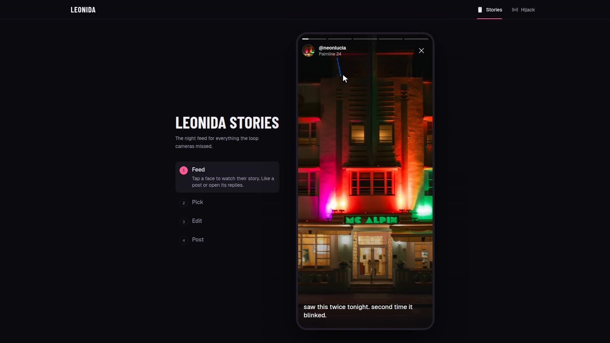
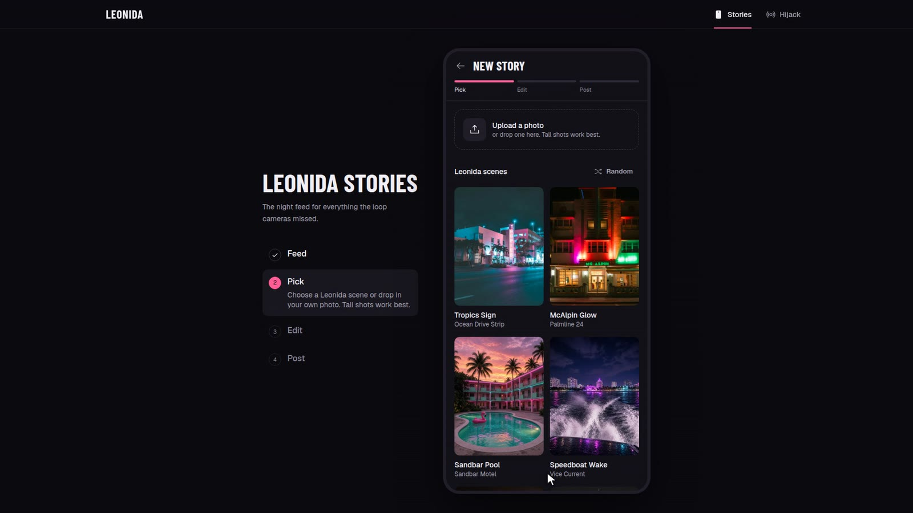
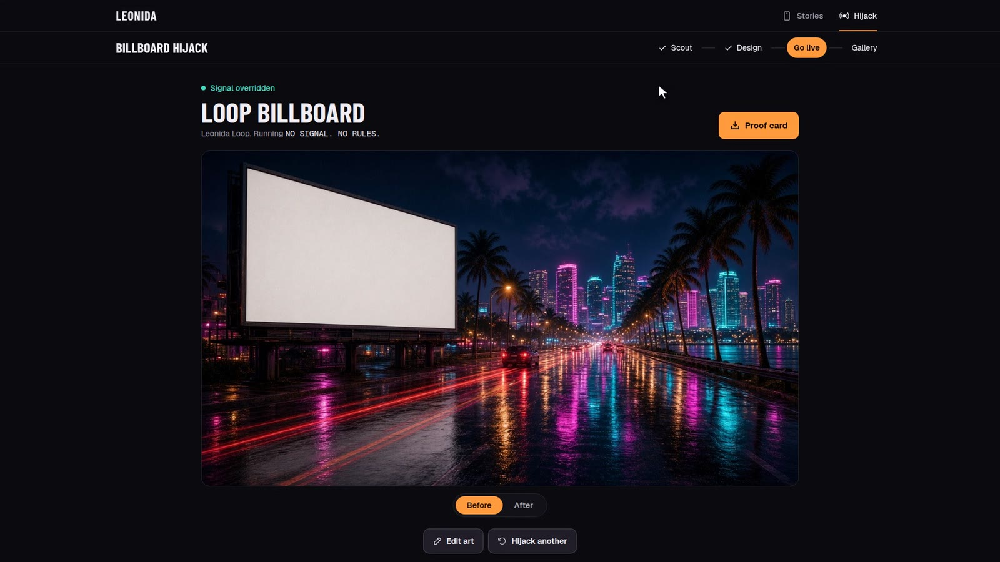
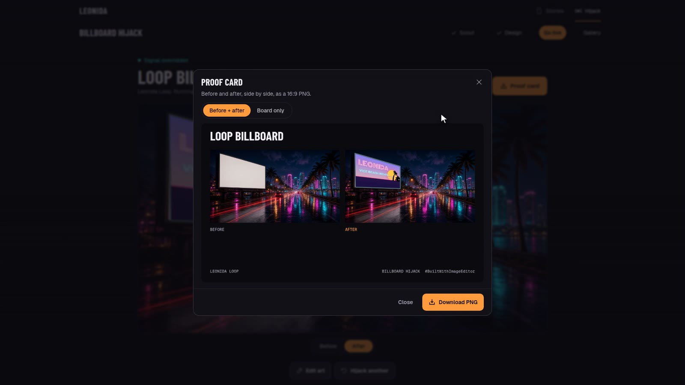

# Judge's walkthrough

A guided five-minute tour of Leonida, with a picture for every step. Open **[leonida-one.vercel.app](https://leonida-one.vercel.app/)** in a desktop browser and follow along. Everything works on a phone too; the layouts just stack.

- [1. Landing](#1-landing)
- [2. Leonida Stories](#2-leonida-stories-about-2-minutes)
- [3. Billboard Hijack](#3-billboard-hijack-about-3-minutes)
- [4. Where the editor lives in the code](#4-where-the-editor-lives-in-the-code)

---

## 1. Landing

The landing page introduces both apps and the one editor underneath them. Click **Open Stories** to start. The top bar switches between **Stories** and **Hijack** at any time.

---

## 2. Leonida Stories (about 2 minutes)

A night-feed phone app. The locals post what the loop cameras missed, and you post back.

### Watch the feed

The rail on the left always tells you which step you're on. Tap any face in the stories row to watch it.

Each story opens full screen in the phone. Close the viewer, then tap the heart on a post to like it.

### Pick a scene

Tap the pink **+** in the tab bar. Choose one of nine original Leonida scenes, or upload your own photo.

### Edit it in React Image Editor

This is the Unlayer React Image Editor, with all eight tools. Try this:

1. **Filter:** pick a preset such as *Kodachrome*.
2. **Text:** choose **Neon** under Effects, double-click the text, type a caption and drag it into place.
3. **Stickers:** add one from any category.
4. Click **Save**. You can't post without saving from the editor.

### Post and get replies

Write a caption and tap **Post to Leonida**. Your story goes to the top of the feed with likes, and the locals reply right away (tap **View replies**). The **You** tab keeps your posts and makes a downloadable share card.

---

## 3. Billboard Hijack (about 3 minutes)

Take over a billboard on the Leonida skyline. Click **Hijack** in the top bar.

### Scout a board

Ten blank boards across Leonida, each in its own original street scene and light. Click through a few, then choose one and press **Design takeover**.

### Design the ad

*The ad above was built from a blank canvas using only the editor's shapes, stickers and neon text (sped up 16×).*

- The **live preview** at top right redraws the real board from the editor about once a second, so you see the ad on the street while you design.
- **Start from** loads a template (Headline, Wanted, Radio spot, Sale burst) with your slogan, a blank canvas, or **Your image** (upload or drop a photo).
- A quick thing to try: pick **Headline**, change the text, add a sticker, then **Save**.

### Go live

After saving, the board flashes the untouched **Before** plate...

...then cuts to **After**, with your ad projected onto the board with real perspective, so the far edge is foreshortened like a printed ad on a real billboard. Use the **Before / After** toggle under the image to compare.

### Download proof

**Proof card** renders a shareable PNG. The default layout shows before and after side by side...

...or switch to **Board only** to download just the hijacked board. **Gallery** in the stepper keeps every takeover from the session.

---

## 4. Where the editor lives in the code

| What | File |
|---|---|
| Shared editor wrapper (all eight tools, dark theme) | [`packages/leonida-ui/src/LeonidaEditor.tsx`](packages/leonida-ui/src/LeonidaEditor.tsx) |
| Stories: edit step, save required to post | [`apps/leonida-stories/src/screens/Editor.tsx`](apps/leonida-stories/src/screens/Editor.tsx) |
| Hijack: templates, upload, live preview from `editor.getImage()` | [`apps/billboard-hijack/src/screens/Design.tsx`](apps/billboard-hijack/src/screens/Design.tsx) |
| Hijack: perspective projection of the saved art onto the board | [`apps/billboard-hijack/src/lib/drawQuadImage.ts`](apps/billboard-hijack/src/lib/drawQuadImage.ts) |
| Hijack: board faces, lighting and plates | [`apps/billboard-hijack/src/data/boards.ts`](apps/billboard-hijack/src/data/boards.ts) |
| Hijack: proof card and board-only export | [`apps/billboard-hijack/src/components/ProofCard.tsx`](apps/billboard-hijack/src/components/ProofCard.tsx) |

Back to the [README](README.md).
